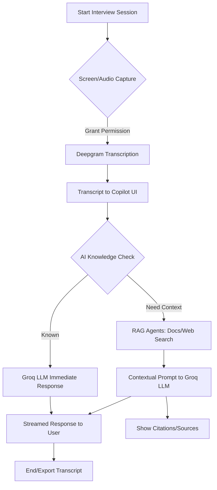

## System Flowchart




---


## Architecture

- *Frontend:* Next.js, React, Tailwind CSS
- *Audio/Video:* Web APIs for screen/audio capture, Deepgram SDK for transcription
- *AI/LLM:* Groq SDK for Llama 3 models, with intelligent routing between LLM and RAG
- *RAG:* Modular agents for document, PDF, and web search (Pinecone, Tavily, etc.)
- *Backend:* API routes for streaming LLM responses, RAG orchestration, and context management

---

## Getting Started

### 1. Clone the Repository
bash```
git clone https://github.com/Trungnef/Interview.git
cd Interview
```

### 2. Install Dependencies
bash```
npm install
# or
yarn install
```

### 3. Configure Environment Variables
Copy .env.example to .env and fill in your API keys:
bash```
cp .env.example .env
```

- GROQ_API_KEY (Groq LLM)
- NEXT_PUBLIC_DEEPGRAM_API_KEY (Deepgram)
- PINECONE_API_KEY, TAVILY_API_KEY, etc. (for RAG)

### 4. Run the App
bash```
npm run dev
# or
yarn dev
```

Visit [http://localhost:3000](http://localhost:3000) to use the Copilot.

---

## Usage

1. *Start Screen Sharing:* Click "Connect" to begin capturing interviewer audio and screen.
2. *Live Transcription:* The Copilot will transcribe all interviewer speech in real time.
3. *Ask Questions:* Type or speak interview questions; the Copilot will provide instant AI-powered suggestions and follow-ups.
4. *Review Sources:* If the AI needs more context, sources and citations will appear after the initial response.
5. *Export/Save:* Download or copy chat transcripts for record-keeping or feedback.

---

## Advanced Capabilities

- *Intelligent LLM Routing:* The Copilot uses a knowledge-check prompt to decide if the LLM can answer directly. If not, it triggers RAG for deeper context.
- *Streaming Responses:* All AI and RAG responses are streamed for minimal latency.
- *Customizable Models:* Easily switch between Groq, Gemini, or OpenAI by updating environment variables and config files.
- *Extensible RAG Agents:* Add new document or web search agents by extending the RAG orchestrator.

---

## File Structure

- /app - Next.js app, API routes, and main pages
- /components - UI components (recorder, chat, PDF manager, etc.)
- /lib - Core logic (transcription manager, LLM/RAG clients, utils)
- /public - Static assets
- /scripts - Setup and utility scripts
- /docs - Technical and integration documentation

---

## Troubleshooting

- *Audio/Screen Not Captured:* Ensure browser permissions are granted for screen and audio.
- *API Errors:* Check your .env file for correct API keys and quotas.
- *Slow Responses:* RAG-based answers may take longer; LLM-only answers are near-instant.
- *UI Issues:* Clear browser cache or try a different browser.

---